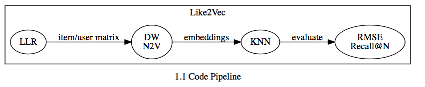
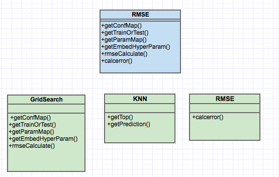

# l2v
Like2Vec implementation



# Dataset

Source:
> F. Maxwell Harper and Joseph A. Konstan. 2015. The MovieLens Datasets: History
and Context. ACM Transactions on Interactive Intelligent Systems (TiiS) 5, 4,
Article 19 (December 2015), 19 pages. DOI=http://dx.doi.org/10.1145/2827872


The original file "ratings.dat" and is in the following format:     
UserID::MovieID::Rating::Timestamp

- UserIDs range between 1 and 6040
- MovieIDs range between 1 and 3952
- Ratings are made on a 5-star scale (whole-star ratings only)
- Timestamp is represented in seconds since the epoch as returned by time(2)
- Each user has at least 20 ratings

# Log-Likelihood Ratio
The Log Likelihood Ratio (LLR) was created by Ted Dunning in his paper, **“Accurate Methods for the Statistics of Surprise and Coincidence".** The LLR relies on calculating similarity between two users or items based on statistics that revolve around occurrences related to these users or items.

To test Log-Likelihood ratio code, "ratings.dat" file had the timestamp removed with:

``` cat ratings.dat | awk -F  "::" '{print $1", " $2", " $3}' > ratings_filtered.dat```

"ratings_filtered.dat" is in the following format:       
**UserID, MovieID, Rating**

The inputs for this module follow the format:       
[USER-ID, MOVIE-ID, RATING]
```
850384,1530,3.0
513501,1530,4.0
152583,1530,3.0
```

The output of the module follows the format:     
((USER-ID1, USER-ID2), LOG LIKELIHOOD RATIO)       
```
((1354067,345351),0.43)
((695858,2397231),0.78)
((2050389,654334),0.15)
```


# Deep Walk

 DeepWalk is an unsupervised learning algorithm that learns a vector representation of each vertex in a graph. Vector representations are learned using walks (usually random walks) on the vertices in the graph.

```
@inproceedings{Perozzi:2014:DOL:2623330.2623732,
 author = {Perozzi, Bryan and Al-Rfou, Rami and Skiena, Steven},
 title = {DeepWalk: Online Learning of Social Representations},
 booktitle = {Proceedings of the 20th ACM SIGKDD International Conference on Knowledge Discovery and Data Mining},
 series = {KDD '14},
 year = {2014},
 isbn = {978-1-4503-2956-9},
 location = {New York, New York, USA},
 pages = {701--710},
 numpages = {10},
 url = {http://doi.acm.org/10.1145/2623330.2623732},
 doi = {10.1145/2623330.2623732},
 acmid = {2623732},
 publisher = {ACM},
 address = {New York, NY, USA},
 keywords = {deep learning, latent representations, learning with partial labels, network classification, online learning, social networks},
}
```


# Root Mean Squared Error
The current RMSE module is to be split in the following classes:


